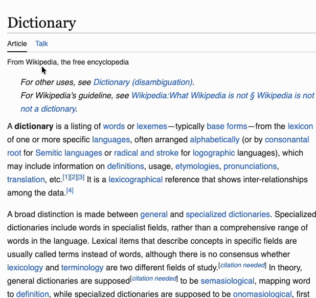
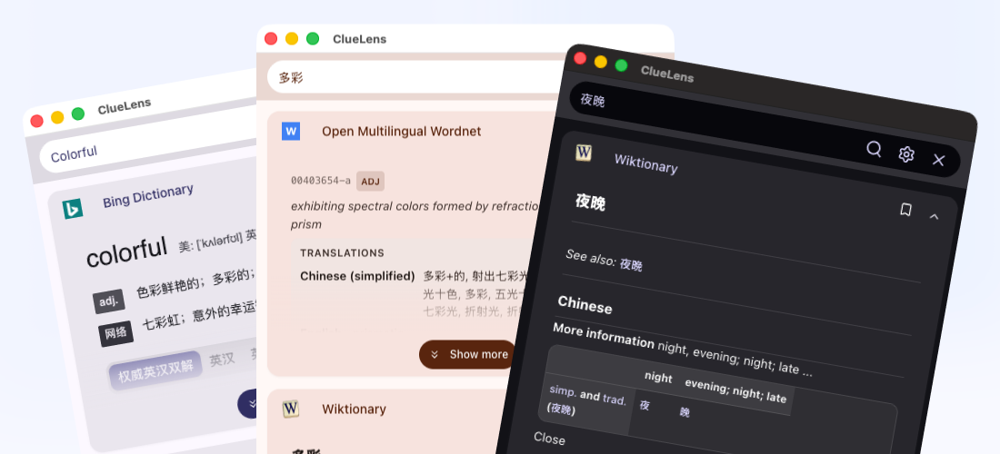

<p align="center">
  
</p>

<h1 align="center">ClueLens</h1>

<p align="center">
  一款浏览器词典与翻译扩展，集成 18 个数据源，支持自动语言检测、TTS 发音、生词本和多形态面板工作流。
</p>

<p align="center">
  <a href="https://github.com/cppakko/cluelens/releases"></a>
  <a href="https://img.shields.io/badge/platform-Chrome%20%7C%20Edge%20%7C%20Firefox-brightgreen.svg"></a>
  <a href="https://github.com/cppakko/cluelens/blob/main/LICENSE"></a>
  <a href="https://linux.do" alt="LINUX DO"></a>
</p>

<p align="center">
  <a href="./README.md">English</a> | 中文
</p>

## 功能介绍

- **18 个查询源并行搜索**：在同一个面板里同时查询 13 个词典、4 个翻译源和 1 个 AI 来源。
- **自动语言检测**：支持中文、日文、韩文、英文、法文、西班牙文、德文，并自动跳过不匹配的来源。
- **发音与 TTS**：既可以播放来源自带音频，也可以使用 Web Speech API 或 Lingva，支持预加载和自动播放。
- **灵活的界面形态**：可用作网页内联悬浮面板、浏览器弹窗（Popup）或侧边栏（Side Panel），并支持右键菜单和快捷键。
- **生词本**：浏览时可一键保存生词，后续搜索、重新查询，并导出为 JSON 或 CSV。
- **Material Design 3 主题**：支持主题种子色、明暗模式、色相、色度、色调和字体定制，也支持 Google Fonts 与上海交大镜像切换。
- **备份与恢复**：可将设置、数据源顺序、生词本以及支持备份的来源配置导出或导入为 JSON。

## 截图

<p align="center">
  
</p>

<p align="center">
  
</p>

## 支持的数据源

### 词典

- Bing 词典
- 剑桥词典
- DictionaryAPI
- DWDS
- Green's 俚语词典
- Jisho (日语)
- Larousse
- 萌娘百科 (Moegirl)
- Open Multilingual Wordnet
- SpanishDict
- Urban Dictionary
- Wiktionary
- 汉典 (Zdic)

### 机翻

- Bing 翻译
- 彩云小译
- DeepLx
- Google 翻译

### AI

- OpenAI（支持官方接口、兼容接口和本地模型）

除 DictionaryAPI、彩云小译、DeepLx 和 OpenAI 外，大多数网页来源都支持在结果卡片中一键打开原始网页。

## 从商店安装

- [Chrome 应用商店](https://chromewebstore.google.com/detail/cluelens-beta/boonogjfoanhlbengnmienaihflicpmp)
- [Firefox 附加组件](https://addons.mozilla.org/zh-CN/firefox/addon/cluelens/)

## 通过 Releases 安装

您可以从 [Releases](https://github.com/cppakko/cluelens/releases) 页面下载最新构建好的扩展包。

### Chrome/Chromium 内核浏览器

1. 下载并解压 `cluelens-xxx-chrome.zip`
2. 在浏览器中打开 `chrome://extensions` 或 `edge://extensions`
3. 开启右上角的 **开发者模式**
4. 点击 **加载已解压的扩展程序**
5. 选择您解压后的文件夹

### Firefox 浏览器

1. 下载并解压 `cluelens-xxx-firefox.zip`
2. 在浏览器中打开 `about:debugging#/runtime/this-firefox`
3. 点击 **临时载入附加组件...**
4. 选择解压后文件夹中的 manifest 文件即可

## 本地构建/开发

### 环境要求

- Node.js 18+
- Yarn 1.x

### 安装依赖

```bash
yarn install
```

### 可选环境变量

若需要预置默认彩云小译 Token，可以创建一个 `.env` 文件进行配置：

```bash
VITE_CAIYUN_DEFAULT_TOKEN=your-caiyun-token
```

### 开发环境运行

```bash
yarn dev
```

如需针对 Firefox 进行开发：

```bash
yarn dev:firefox
```

### 本地打包构建

```bash
yarn build
```
